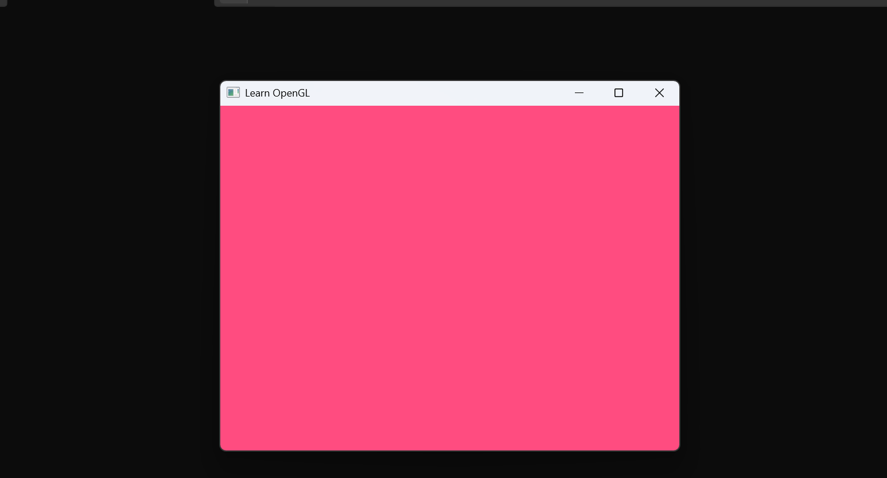

# LearnOpenGL Journey

This repository documents my journey learning modern OpenGL, from the fundamentals to more advanced rendering techniques. My goal is to build a solid understanding of real-time graphics programming as the first step towards developing my own 3D engine.

## Why OpenGL?

Although modern engines such as Unreal Engine and Unity abstract most graphics programming, understanding the underlying graphics pipeline is essential for anyone interested in graphics engine development.

I've always been fascinated by how 3D worlds are rendered. Graphics engines such as **Northlight** (Remedy Entertainment), **Source Engine** (Valve), **id Tech** (id Software) and **Creation Engine** (Bethesda Game Studios) have inspired me to understand how these systems work internally and, eventually, build one of my own.

This repository serves as a record of that learning process.

---

## Objectives

- Learn and master Modern OpenGL.
- Understand the real-time graphics pipeline.
- Learn the mathematics behind 3D graphics.
- Build a strong foundation for developing my own graphics engine.

---

## Progress

### Basic OpenGL

- [x] Creating a Window
- [ ] Rendering a Triangle
- [ ] Shaders
- [ ] Textures
- [ ] Camera
- [ ] Lighting
- [ ] Model Loading

### Advanced OpenGL

- [ ] Blending
- [ ] Framebuffers
- [ ] Cubemaps
- [ ] Advanced GLSL
- [ ] Geometry Shaders
- [ ] Anti-Aliasing
- [ ] Advanced Lighting

---

## Chapter Notes
### 01 - Hello Window
**Learned Concepts**

-How to initiate a window
-Diference between GLFW, OpenGL and GLAD
-How render loops are created and for what
-Frame Buffer Size Callbacks

### Result

### 02 - Hello Triangle
**Learned Concepts**

-

## Resources

- LearnOpenGL — https://learnopengl.com
- *Mathematics for 3D Game Programming and Computer Graphics* — Eric Lengyel
